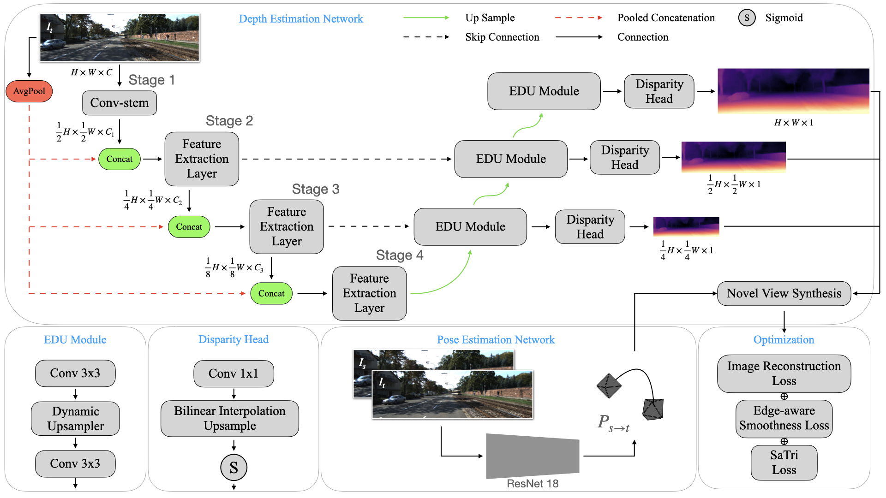
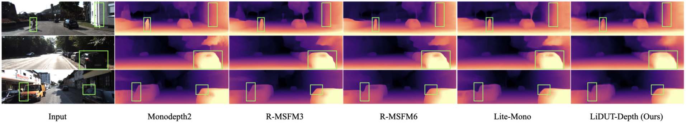

<div id="top" align="center">
  
# LiDUT-Depth 
**LiDUT-Depth: A Lightweight Self-supervised Depth Estimation Model featuring Dynamic Upsampling and Triplet Loss Optimization**
  
  Hao Jiang
  
<a href="#license">
  
</a>  


(LiDUT-Depth 1024x320) 
  
</div>


## Table of Contents
- [LiDUT-Depth](#lidut-depth)
  - [Table of Contents](#table-of-contents)
  - [Overview](#overview)
  - [Results](#results)
    - [KITTI](#kitti)
  - [Setup](#setup)
  - [Data Preparation](#data-preparation)
  - [Single Image Test](#single-image-test)
  - [Evaluation](#evaluation)
  - [Training](#training)
      - [start training](#start-training)
      - [tensorboard visualization](#tensorboard-visualization)
  - [Citation](#citation)


## Overview


<br/>




## Results
### KITTI
You can download the trained models using the links below.  

|     Model     | Params | ImageNet Pretrained | Input size |  Abs Rel  |   Sq Rel  |    RMSE   |  RMSE log | delta < 1.25 | delta < 1.25^2 | delta < 1.25^3 |
|:---------------:|:------:|:-------------------:|:----------:|:---------:|:---------:|:---------:|:---------:|:------------:|:--------------:|:--------------:|
|  <span style="white-space:nowrap">[**LiDUT-Depth_640x192**](https://drive.google.com/file/d/1epYb-7UAv-3jMLfhjULhDJ7Fr0-bOx5M/view?usp=drive_link)</span>  |  3.1M  |         [yes](https://drive.google.com/file/d/1u1q4BmxnFPbfDogHksH5cJshetwX3g5D/view?usp=drive_link)         |   640x192  | 0.103 | 0.723 | 4.469 | 0.178 |   0.889  |    0.964   |    0.984   |
|  <span style="white-space:nowrap">[**LiDUT-Depth_1024x320**](https://drive.google.com/file/d/19avg-ojQxPdh98W547PJqO6TtkYsZQAm/view?usp=drive_link)</span>  |  3.1M  |         yes         |  1024x320  | 0.101 | 0.703 | 4.354 | 0.175 |   0.895  |    0.966   |    0.985   |

## Setup
Assuming a fresh [Anaconda](https://www.anaconda.com/download/) distribution, you can install the dependencies with:

```shell
conda create -n lidut-depth python=3.10
conda activate lidut-depth

pip install -r requirements.txt
pip install 'git+https://github.com/saadnaeem-dev/pytorch-linear-warmup-cosine-annealing-warm-restarts-weight-decay'
```

We ran our experiments with PyTorch 2.0.1, CUDA 11.8, Python 3.10.12 and Ubuntu 20.04.

We recommend using a [conda environment](https://conda.io/docs/user-guide/tasks/manage-environments.html) to avoid dependency conflicts.


## Data Preparation
You can download the entire [raw KITTI dataset](http://www.cvlibs.net/datasets/kitti/raw_data.php) by running:

```shell
wget -i splits/kitti_archives_to_download.txt -P kitti_data/
```

Then unzip with

```shell
cd kitti_data
unzip "*.zip"
cd ..
```

**Warning:** it weighs about **175GB**, so make sure you have enough space to unzip too!

Our default settings expect that you have converted the png images to jpeg with this command, **which also deletes the raw KITTI `.png` files**:

```shell
find kitti_data/ -name '*.png' | parallel 'convert -quality 92 -sampling-factor 2x2,1x1,1x1 {.}.png {.}.jpg && rm {}'
```

**or** you can skip this conversion step and train from raw png files by adding the flag `--png` when training, at the expense of slower load times.

Pre-computed [segmentation images](https://drive.google.com/file/d/1FNxJzGTfP1O_pUX9Va7d0dqZWtRi833X/view) provided by [FSRE-Depth](https://github.com/hyBlue/FSRE-Depth) are also needed for training.

**Note**: The pre-computed segmentation is **NOT** needed for evaluating.


```shell
KITTI-DATA/
    ├── 2011_09_26/             
    ├── 2011_09_28/                    
    ├── 2011_09_29/
    ├── 2011_09_30/
    ├── 2011_10_03/
    └── segmentation/   # download and unzip "segmentation.zip" 
```

## Single Image Test
    python test_simple.py --load_weights_folder path/to/your/weights/folder --image_path path/to/your/test/image


## Evaluation
Evaluate the weights of a single epoch:
```shell
python evaluate_depth.py --load_weights_folder path/to/your/weights/folder --data_path path/to/kitti_data/
```

Or evaluate the weights of every epochs together (will print all the evaluate results to a txt file in your model folder):
```shell
python evaluate_depth_all.py --load_weights_folder path/to/your/model/folder --data_path path/to/kitti_data/ --num_epochs number/of/your/epochs/to/evaluate
```

To evaluate the model's generalization ability, you'll need to prepare the Make3D dataset first. Download Test134 [images](http://www.cs.cornell.edu/~asaxena/learningdepth/Test134.tar.gz) and [depths](http://www.cs.cornell.edu/~asaxena/learningdepth/Test134Depth.tar.gz), simply uncompress them to `./splits/make3d`, then run `./splits/make3d/make3d_extraction.py` to get the image filenames, finally run `./evaluate_depth_make3d.py` to get the generalization ability result (you may need to modify the data path in the code):
```shell
python evaluate_depth_make3d.py
```

## Training

#### start training
```shell
python train.py --data_path path/to/your/data --model_name test --num_epochs 30 --batch_size 12 --num_workers 16 --mypretrain path/to/your/pretrained/weights
```
    
#### tensorboard visualization
```shell
tensorboard --log_dir ./tmp/mytrain
```

## Citation
```shell
# coming online soon
```
